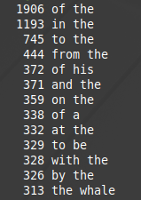

### Program
This program is an exercise in building a solid hash table to improve lookup performance.  
 
The program processes text files, counting the occurrence of each word pair, and then prints
the word pairs appearing most frequently.

    A word is any string of text seperated by whitespace. That includes the break between files.
    For example, if the last word in File1 is "blue" and the first word in File2 is "sky", this
    counts as 1 occurrence of the word pair "blue sky".
 

### Hash Table 
The hash table can be repurposed by modifying the struct _Data object in the hash.h header file to 
suit the needs of the data that will be stored by the hash table.

The user must also create two functions, required as arguments when calling the table creation function:
 
- 1). The first function provides the logic for comparing two Data objects so the hash table can determine
    when there is a repetition of data.
- 2). The second must provide the logic for freeing all memory tied up in an individual Data object.

The typedef for these two functions exist within the hash.h file as entryCompareFnx and fnxFreeData 
 

### Program Execution
    wordpairs <-count> fileName1 <fileName2> <fileName3> ...

    where count is an optional integer specifying how many of the most frequent word pairs will be printed.
    if omitted, the program will print all word pairs.

    The program requires at least one valid filepath, but more can be specified. 

### Program Compilation
"make"ing the recipe with the provided makefile is sufficient.
